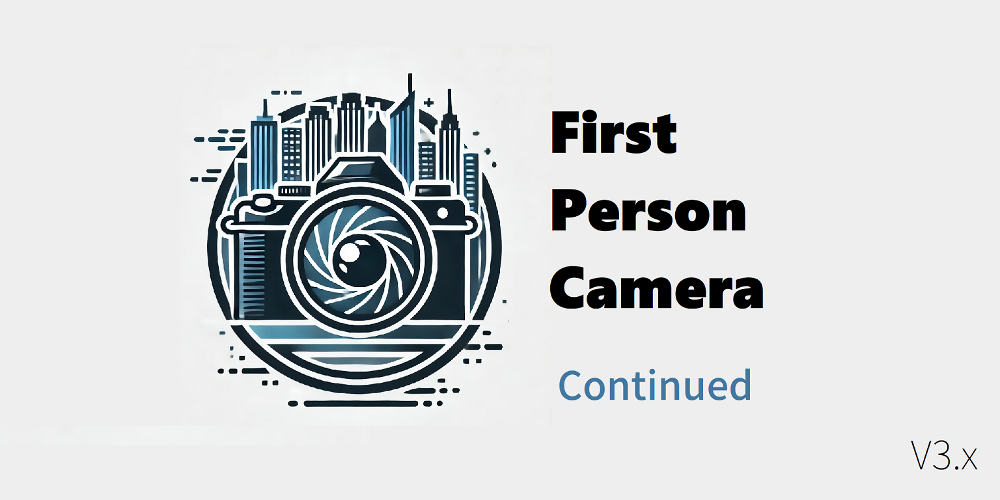

# Cities: Skylines - First Person Camera Mod v2 汉化版

## 请在下载前先取订或卸载[原模组](https://steamcommunity.com/sharedfiles/filedetails/?id=2764243667)！
## 同时，也请安装前置[Harmony](https://github.com/boformer/CitiesHarmony/releases)。

> 这是[First Person Camera v2.2.0 by Asu4ni](https://steamcommunity.com/sharedfiles/filedetails/?id=2764243667)的汉化版本。
> 同时也是[First Person Camera: Updated by tony56a](https://steamcommunity.com/sharedfiles/filedetails/?id=650805785)的更新版本。

[First Person Camera（第一人称相机）](https://github.com/Asu4ni/CitiesSkylines-FPSCamera)是一个轻量级的mod，在原来的[Cities: Skylines](https://www.citiesskylines.com)上附加了一个额外的**相机控制器**，使用户能够以第一人称视角查看他们的城市。
有关如何使用该模组以及如何为开发做出贡献的说明和指南，请参阅[Wiki](https://github.com/Asu4ni/CitiesSkylines-FPSCamera/wiki)。

---
> 也可前往[Steam 创意工坊](https://steamcommunity.com/sharedfiles/filedetails/?id=3044638930)下载。

