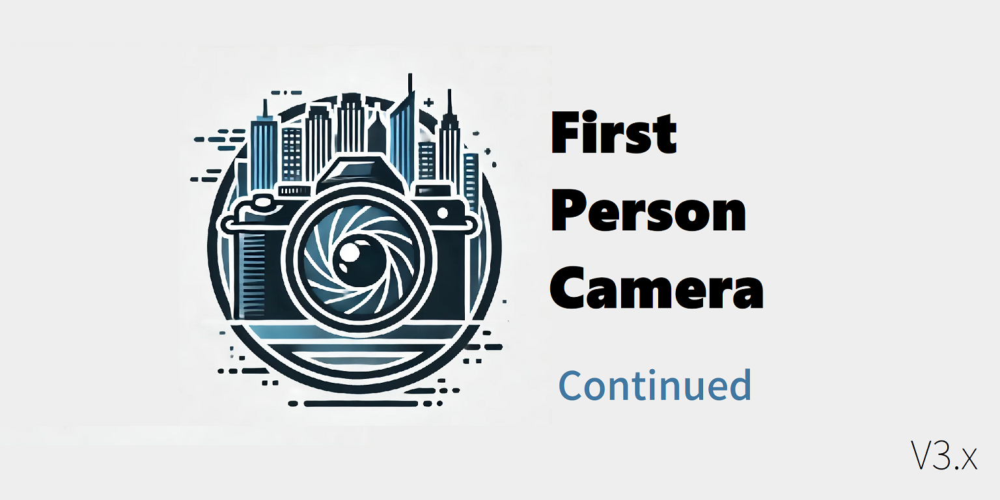

# Cities: Skylines（城市：天际线）
# First Person Camera（第一人称摄像机） - Continued

# [English](README.md) / 中文

## 在下载前，请先卸载[原模组](https://steamcommunity.com/sharedfiles/filedetails/?id=2764243667)！
## 此外需安装前置模组[Harmony](https://github.com/boformer/CitiesHarmony/releases)。

> 本模组是[First Person Camera v2.2.0 by Asu4ni](https://steamcommunity.com/sharedfiles/filedetails/?id=2764243667)的更新版本。

> 如果你是初次使用，建议前往[维基](https://github.com/will258012/FPSCamera-Continued/wiki)了解模组功能以及使用方法。

## 协助翻译：

（模组自带简体中文）
---
> 欲查看更多信息，请访问[创意工坊](https://steamcommunity.com/sharedfiles/filedetails/?id=3198388677)。模组也可在那里下载。
